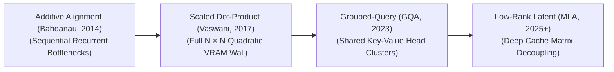

# Awesome-Self-Attention
## Self-Attention: Evolution, Variants, Types, & Applications

Self-Attention—formally conceptualized as Scaled Dot-Product Attention—is the core mathematical mechanism driving the Transformer architecture. Unlike prior recurrent or convolutional networks that process sequential data step-by-step or within localized sliding windows, Self-Attention allows every single token in a sequence to look at, calculate an allocation weight for, and aggregate contextual parameters from every other token *simultaneously and in parallel*. By projecting input embeddings into dynamically computed Query ($Q$), Key ($K$), and Value ($V$) spaces, Self-Attention maps long-range semantic dependencies with a constant path length of $O(1)$, serving as the baseline cognitive engine for modern Large Language Models (LLMs) and multi-modal foundation AI.

---

## 1. The Chronological Evolution

The technical progression of cross-token alignment has transitioned from sequential recurrence baselines to full quadratic matrices, memory-pinned group query structures, and low-rank latent cache compressions.

| Variant / Era | Year | First Paper | Concept | Limitation / Significance |
| :--- | :--- | :--- | :--- | :--- |
| **The Sequential Alignment Precursor (Bahdanau Attention)** | 2014 | [Bahdanau et al., 2014](https://arxiv.org/abs/1409.0473) | Developed to fix the fixed-length vector bottleneck in Recurrent Neural Networks (RNNs). It computed a localized, additive alignment score between hidden states sequentially, letting an encoder-decoder network dynamically "focus" on specific historical words during translation. | *Limitation:* Rigidly bound to the underlying sequential recurrent steps, making it mathematically impossible to parallelize across GPU hardware arrays. |
| **The Scaled Dot-Product Revolution (Vaswani et al., 2017)** | 2017 | [Vaswani et al., 2017](https://arxiv.org/abs/1706.03762) | The defining milestone of modern generative AI. It discarded recurrence completely, replacing it with the parallelized Multi-Head Attention (MHA) graph [INDEX: 1]. It introduced the standard scaling factor ($1/\sqrt{d_k}$) to prevent dot products from growing excessively large in high dimensions, stabilizing Softmax gradients during training. | *Limitation:* Created a massive **Quadratic Memory and Compute Wall ($O(N^2)$)** relative to context length, alongside a severe Key-Value (KV) cache memory bottleneck during inference. |
| **The Head-Grouping and Caching Era (MQA / GQA)** | 2019 / 2023 | [Shazeer, 2019 (MQA)](https://arxiv.org/abs/1911.02150) [Ainslie et al., 2023 (GQA)](https://arxiv.org/abs/2305.13245) | Addressed the inference memory capacity crisis. Multi-Query Attention (MQA) collapsed all Key and Value matrices into a single shared head. To balance accuracy with speed, **Grouped-Query Attention (GQA)** emerged as the industry production default (e.g., Llama 3), clustering multiple distinct Query heads to share single, localized Key-Value head pairs. | *Significance:* Slashed KV cache memory utilization during auto-regressive generation, unlocking vastly higher concurrent serving batch sizes. |
| **The Low-Rank Latent Decomposed Era (DeepSeek MLA)** | 2024 | [DeepSeek-V2, 2024](https://arxiv.org/abs/2405.04434) | The modern state-of-the-art frontier infrastructure standard. Pioneered by **Multi-Head Latent Attention (MLA)**, it compresses the Key-Value cache down into a tiny, low-rank latent vector before the multi-head projection occurs, dynamically up-projecting matrices inside fast on-chip GPU SRAM. | *Significance:* Slashed KV cache VRAM footprint by up to $93\%$ compared to standard MHA, vastly outperforming GQA while retaining full-attention modeling accuracy. |

---

## 2. Core Functional & Structural Variants

Self-attention blocks are strictly categorized based on how token visibility masks are enforced and how the projection dimensions partition information.

| Variant | Year | First Paper | Mechanism | Application |
| :--- | :--- | :--- | :--- | :--- |
| **Bidirectional Self-Attention (Encoder-Style)** | 2017 | [Vaswani et al., 2017](https://arxiv.org/abs/1706.03762) | Permits every token to look at and gather context from all other tokens across the entire sequence length concurrently. | Dominates comprehension-heavy architectures (like BERT) to extract deep, holistic contextual representations. |
| **Causal Self-Attention (Decoder-Style)** | 2017 | [Vaswani et al., 2017](https://arxiv.org/abs/1706.03762) | Overrides the upper-triangular region of the pre-softmax attention matrix with absolute negative infinity ($-\infty$). Tokens are mathematically blocked from seeing future parameters, looking strictly backward at historical indices. | The foundational engine driving auto-regressive generative systems (like GPT, Claude, and Llama). |
| **Cross-Attention** | 2017 | [Vaswani et al., 2017](https://arxiv.org/abs/1706.03762) | Unifies two completely separate data streams or modalities. The Queries ($Q$) are projected from one model layer (e.g., text hidden states), while the Keys ($K$) and Values ($V$) are derived from an external source (e.g., a Vision Transformer's image patch matrix). | — |
| **Multi-Head Attention (MHA)** | 2017 | [Vaswani et al., 2017](https://arxiv.org/abs/1706.03762) | Divides the total hidden representation space ($d_{model}$) into multiple, independent lower-dimensional parallel head matrices, allowing the model to simultaneously track information from different representation spaces at different positions [INDEX: 1]. | — |

---

## 3. Algorithmic Scale Optimization Types

To process ultra-long context windows (e.g., full code repositories or continuous video streams), specialized kernels modify the physical execution of the attention matrix.

| Optimization Type | Year | First Paper | Mechanism | Significance / Pros |
| :--- | :--- | :--- | :--- | :--- |
| **FlashAttention Kernels (Hardware-Aware Fusion)** | 2022 | [Dao et al., 2022](https://arxiv.org/abs/2205.14135) | Rewrites the compute execution graph. It uses tiling strategies to load Query, Key, and Value blocks into fast, on-chip GPU SRAM, computing the Softmax normalization incrementally without ever writing the massive $N \times N$ attention matrix out to slow High Bandwidth Memory (HBM). | *Significance:* Dropped memory footprints from quadratic down to true linear scaling ($O(N)$), maximizing hardware processing throughput. |
| **Sliding Window Local Attention** | 2020 | [Beltagy et al., 2020](https://arxiv.org/abs/2004.05150) | Imposes a structural geometric constraint where a token can only compute attention scores with a tight, local neighborhood of adjacent tokens ($i \pm W/2$), masking out distant indices. | — |
| **Linear Attention Approximation (Kernel Tricks)** | 2020 | [Katharopoulos et al., 2020](https://arxiv.org/abs/2006.16236) | Exploits the associative property of matrix multiplication by using kernel map functions to approximate the Softmax curve, altering the calculation sequence from $(Q K^T)V$ to $Q (K^T V)$. | *Pros:* Drops time and space complexity to true linear bounds relative to token length, enabling infinite streaming context steps. |

---

## 4. Production Engineering Challenges & Mitigations

Deploying full-attention layers across massive enterprise server clusters introduces intense VRAM allocation caps and communication penalties.

| Challenge | Year | First Paper | The Problem | Mitigation |
| :--- | :--- | :--- | :--- | :--- |
| **The Key-Value (KV) Cache VRAM Satiation Wall** | 2023 | [Kwon et al., 2023](https://arxiv.org/abs/2309.06180) | During long-context auto-regressive decoding, the historical attention maps must be cached continuously in memory to avoid redundant recomputations. As context windows scale to 128k+ tokens, this KV cache swells to gigabytes per user layer, triggering cluster-wide Out-of-Memory crashes. | Pairing **Multi-Head Latent Attention (MLA)** arrays with **PagedAttention virtual memory indexing** to eliminate memory fragmentation while compressing tensor dimension footprints. |
| **The Unstructured Sparsity GPU Core Stall** | 2019 | [Child et al., 2019](https://arxiv.org/abs/1904.10509) | Restricting individual random tokens arbitrarily via custom sparse attention masks introduces non-contiguous, fragmented memory lookups. This prevents GPUs from saturating their massive, hardwired parallel tensor processing blocks, resulting in execution latency. | Transitioning entirely to **Block-Sparse Attention kernels**, ensuring any structural sparsification map operates over strict $16 \times 16$ or $64 \times 64$ dense block arrays to optimize silicon throughput. |

---

## 5. Frontier Real-World AI Applications

| Application Field | Year | First Paper | Application Details |
| :--- | :--- | :--- | :--- |
| **Autoregressive Sequence Modeling for Frontier LLMs** | 2018 | [Radford et al., 2018](https://s3-us-west-2.amazonaws.com/openai-assets/research-covers/language-unsupervised/language_understanding_paper.pdf) | Serves as the core engine driving foundational base models and post-training reasoning architectures. Causal multi-head self-attention enables deep networks to track complex variables, cross-reference long legal briefs, and map functional code syntaxes flawlessly over thousands of conversational turns. |
| **Vision-Transformer Visual Token Patchification (ViTs)** | 2020 | [Dosovitskiy et al., 2020](https://arxiv.org/abs/2010.11929) | Replaces traditional convolutions across advanced computer vision backbones. Flattened image patches are processed through global self-attention layers, allowing the network to capture global spatial context and complex part-whole layouts natively from layer zero. |
| **Spatio-Temporal Video Generative Flow-Matching** | 2024 | [OpenAI, 2024](https://openai.com/research/video-generation-models-as-world-simulators) | Powers high-fidelity physical simulation networks (such as Sora or LTX-Video). Video clips are chunked into 3D spacetime token cubes; the factorized multi-head attention blocks process these cubes concurrently, tracking horizontal, vertical, and chronological frame changes to generate fluid, consistent animations. |
