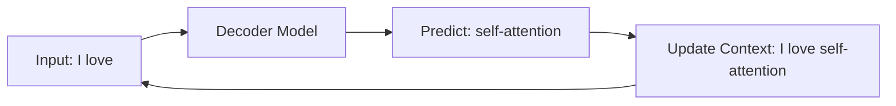

# Autoregressive Sequence Modeling for Frontier LLMs

Autoregressive models predict the next token in a sequence given the previous history. This is the cornerstone of modern generative LLMs.

## Role of Self-Attention
Causal multi-head self-attention allows the model to retrieve context from arbitrary previous positions instantly, facilitating complex reasoning, long-document understanding, and multi-turn chat retention.

## Generation Cycle

---
[← Back to README](../README.md)
