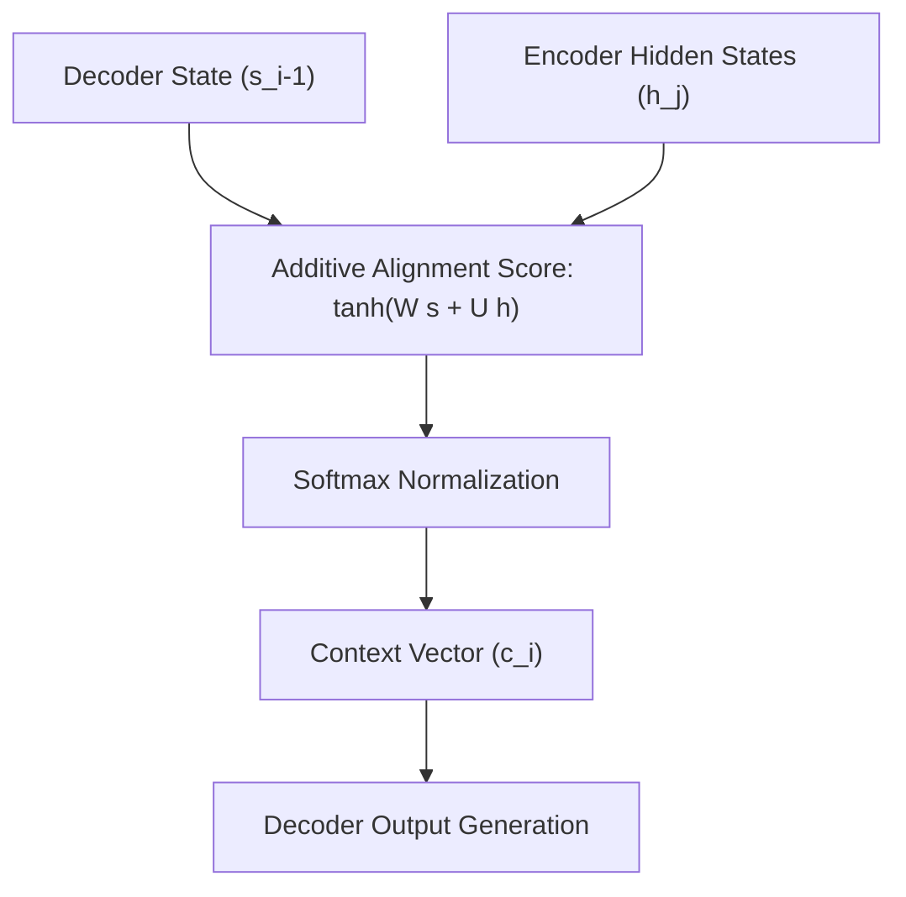

# Bahdanau Attention (Additive Alignment)

Bahdanau Attention was introduced by Dzmitry Bahdanau et al. in 2014 to resolve the bottleneck of fixed-length representation vectors in standard Recurrent Neural Networks (RNNs) for Sequence-to-Sequence tasks (like translation).

## How It Works
Instead of compressing the entire source sequence into a single context vector, Bahdanau attention keeps all intermediate hidden states of the encoder. At each step of the decoder, it calculates an alignment score between the current decoder hidden state $s_{i-1}$ and all encoder hidden states $h_j$:

$$e_{ij} = v_a^T \tanh(W_a s_{i-1} + U_a h_j)$$

These scores are normalized using a Softmax function to produce the attention weights, which are then used to compute a weighted sum of the encoder hidden states as the context vector.

## Architecture Diagram

---
[← Back to README](../README.md)
