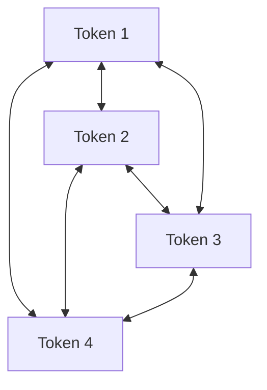

# Bidirectional Self-Attention (Encoder-Style)

Bidirectional self-attention allows each token in the input sequence to attend to all other tokens, regardless of whether they appear before or after in the sequence.

## Use Cases
It is typical of encoder-style architectures such as BERT. It is ideal for sequence understanding, text classification, and named entity recognition, where context from both left and right is crucial.

## Interaction Matrix

---
[← Back to README](../README.md)
