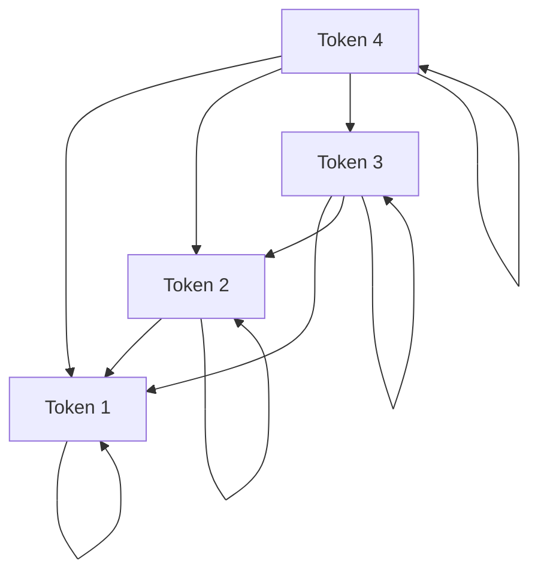

# Causal Self-Attention (Decoder-Style)

Causal self-attention ensures that when generating or encoding a token at position $t$, the model can only attend to positions $\le t$. Future tokens are masked out.

## Masking Mechanism
During computing dot-product scores, an upper triangular mask with $-\infty$ values is added to the logit matrix before Softmax:

$$\text{Masked Scores} = Q K^T + M$$

where $M_{ij} = 0$ if $i \ge j$, and $-\infty$ otherwise.

## Causal Matrix Flow

---
[← Back to README](../README.md)
