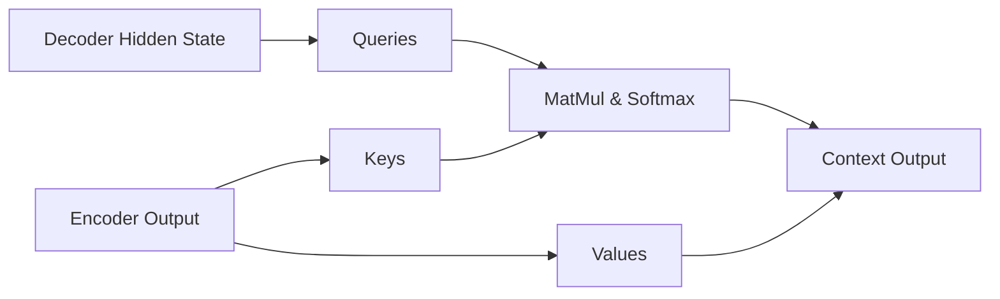

# Cross-Attention

Cross-attention dynamically mixes information from two different sequences or modalities. It is the key mechanism in encoder-decoder structures.

## Alignment
*   **Queries (Q):** Derived from the target decoder sequence.
*   **Keys (K) & Values (V):** Derived from the source encoder sequence.

This enables the target sequence generation to be conditioned on representations from the source sequence.

## Interaction Flow

---
[← Back to README](../README.md)
