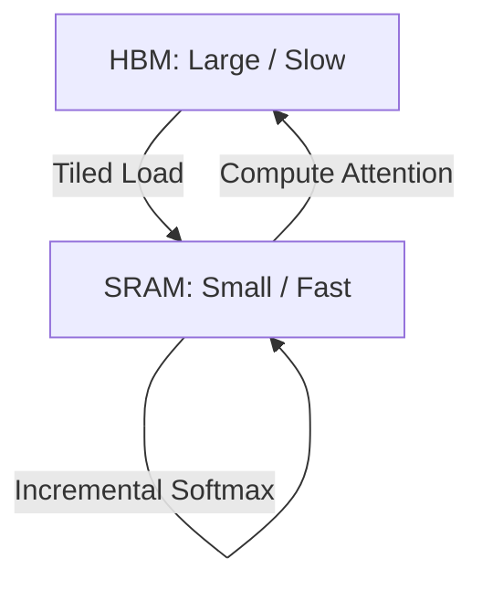

# FlashAttention Kernels (Hardware-Aware Fusion)

FlashAttention is an algorithm proposed by Tri Dao et al. that accelerates attention and reduces memory footprint by making it IO-aware of GPU memory hierarchies.

## Core Optimization
Standard attention writes the large $N \times N$ intermediate softmax matrix to slow High Bandwidth Memory (HBM). FlashAttention splits the input into blocks, loads them to fast SRAM, and computes Softmax incrementally (using tiling and recomputation in the backward pass).

## Memory Hierarchy Flow

---
[← Back to README](../README.md)
