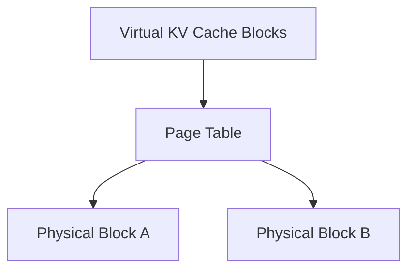

# Key-Value (KV) Cache VRAM Satiation Wall

In auto-regressive generation (LLM serving), history keys and values are cached to avoid redundant quadratic operations. This memory requirement scales linearly with batch size and context length, hitting the VRAM limit.

## Mitigations
*   **PagedAttention:** Allocates KV cache memory in non-contiguous virtual blocks, preventing memory fragmentation.
*   **Low-Rank Compressors:** Such as Multi-Head Latent Attention (MLA).

## Memory Fragmentation Mitigation

---
[← Back to README](../README.md)
