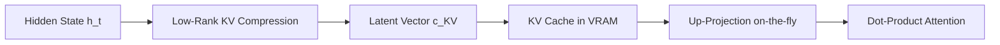

# Multi-Head Latent Attention (MLA)

Multi-Head Latent Attention (MLA) was introduced by DeepSeek-V2 in 2024 to dramatically compress the Key-Value (KV) cache during inference without sacrificing performance.

## Core Design
MLA uses Low-Rank Joint Compression. Key and Value vectors are compressed into a lower-dimensional latent space before projection:

$$c^{KV}_t = W^{KV}_d h_t$$

During generation, only the compressed latent cache $c^{KV}_t$ is cached, reducing VRAM usage by up to $93\%$. The keys and values are reconstructed dynamically on-the-fly.

## Architecture

---
[← Back to README](../README.md)
