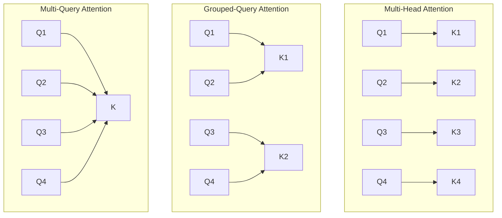

# Multi-Query (MQA) & Grouped-Query Attention (GQA)

As Large Language Models (LLMs) scale, inference becomes bottlenecked by Key-Value (KV) cache memory bandwidth. MQA and GQA were introduced to optimize serving throughput.

## Comparison
*   **Multi-Head Attention (MHA):** Each query head has its own key and value head.
*   **Multi-Query Attention (MQA):** All query heads share a single key and value head. (High compression, slight accuracy degradation).
*   **Grouped-Query Attention (GQA):** Query heads are partitioned into groups, and each group shares a key-value head. (Balances MHA accuracy with MQA speed).

## Head Configurations

---
[← Back to README](../README.md)
