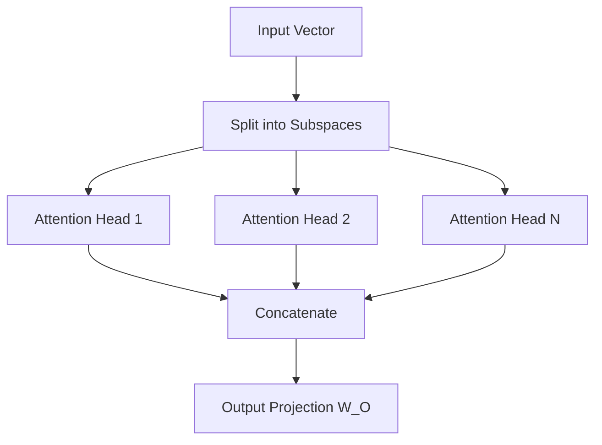

# Multi-Head Attention (MHA)

Multi-Head Attention divides the model's hidden dimension into multiple subspace projections, letting the model focus on different aspects of positions simultaneously.

## Formula
$$\text{MultiHead}(Q, K, V) = \text{Concat}(\text{head}_1, \dots, \text{head}_h) W^O$$

$$\text{where } \text{head}_i = \text{Attention}(Q W_i^Q, K W_i^K, V W_i^V)$$

This allows the model to attend to information from different representation subspaces at different positions.

## Head Partitioning

---
[← Back to README](../README.md)
