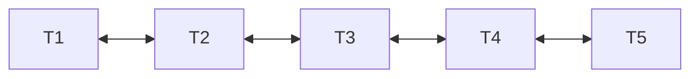

# Sliding Window Local Attention

Sliding Window Attention limits the attention receptive field of each token to a fixed local window size $W$, transforming the sequence length complexity from $O(N^2)$ to $O(N \times W)$.

## Mechanism
A token at index $i$ only computes attention with indices between $i - W/2$ and $i + W/2$. Stacked layers naturally increase the receptive field, allowing higher layers to capture global context.

## Receptive Window

---
[← Back to README](../README.md)
