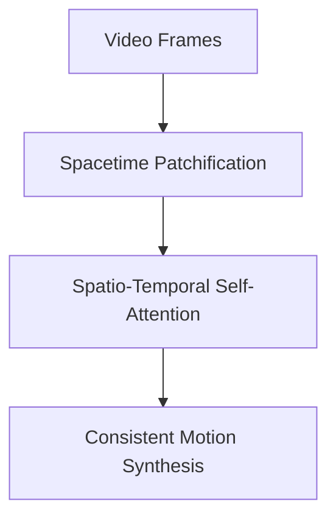

# Spatio-Temporal Video Generative Flow-Matching

Video generators must capture both spatial details and chronological continuity. This is achieved by representing video sequences as 3D spatio-temporal volumes.

## Mechanics
Video frames are patchified along both space (height/width) and time dimensions. These 3D spacetime token cubes are fed into large Diffusion Transformers (DiT), learning spatial layouts and temporal motion dynamics in parallel.

## Spacetime Processing

---
[← Back to README](../README.md)
