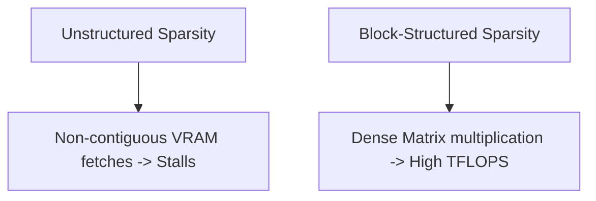

# Unstructured Sparsity GPU Core Stall

While sparse attention masks reduce computational complexity theoretically, arbitrary unstructured sparsity causes GPU execution stalls.

## The Cause
GPUs are designed for highly parallel, structured memory access. Random, sparse indexing prevents coalesced memory reads and tensor core vectorization, rendering sparse calculations slower than dense operations.

## Block-Sparse Solution
To maintain high hardware utilization, block-sparse attention partitions the matrix into dense blocks (e.g., $16 \times 16$ or $64 \times 64$), keeping memory layouts continuous.

---
[← Back to README](../README.md)
